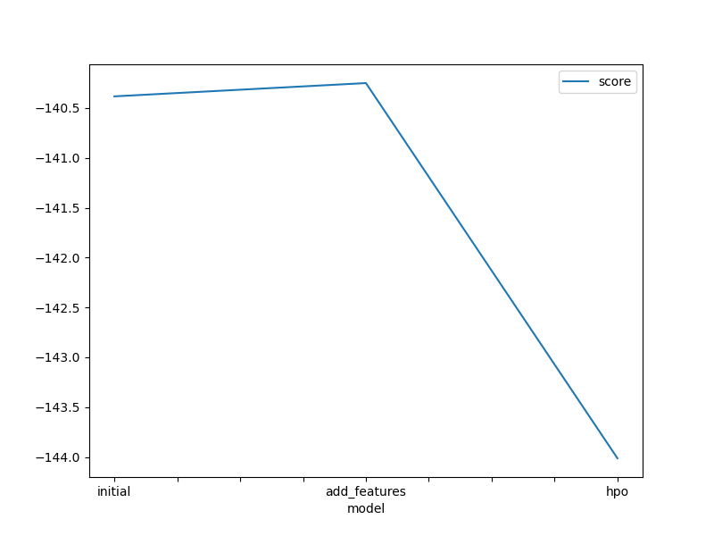
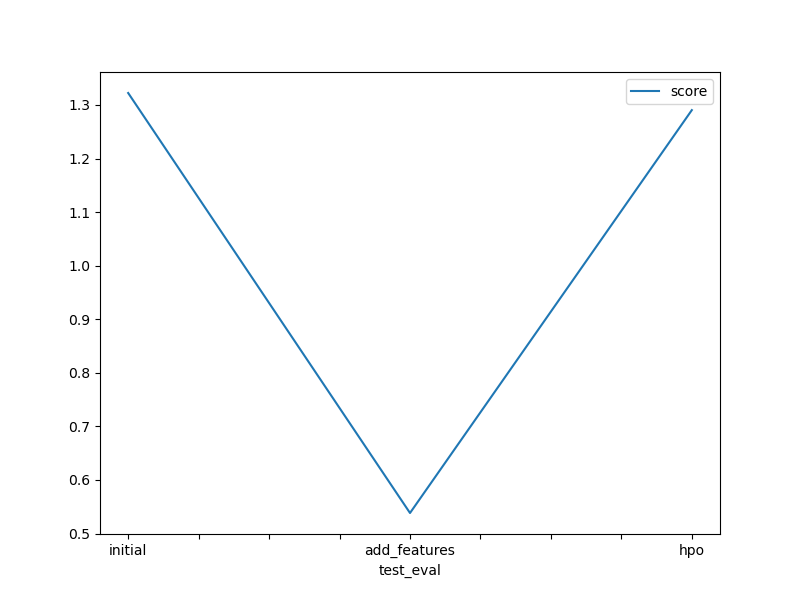

# Report: Predict Bike Sharing Demand with AutoGluon Solution
#### HAJER TALBI

## Initial Training
### What did you realize when you tried to submit your predictions? What changes were needed to the output of the predictor to submit your results?
When I first attempted to submit my predictions, I encountered a critical issue: the datetime column was missing from my submission file. The problem occurred because my predictions were returned as a pandas Series with datetime as the index, but Kaggle's submission format requires datetime as a regular column alongside the count predictions.
The key changes needed were:

Reset the index to convert datetime from index to a column
Create a proper DataFrame with 'datetime' and 'count' columns
Handle negative predictions by setting them to zero (Kaggle rejects negative bike counts)

The solution was to use:
pythonpredictions_df = predictions.reset_index()
predictions_df.columns = ['datetime', 'count']
predictions_df.to_csv("submission.csv", index=False)

### What was the top ranked model that performed?
The top-ranked model from the initial training was WeightedEnsemble_L3, which is AutoGluon's sophisticated ensemble method that combines multiple base models. AutoGluon automatically creates a multi-layer ensemble that includes:

Layer 1: Base models (GBM, Neural Networks, Random Forest, etc.)
Layer 2: Ensemble of Layer 1 models
Layer 3: Final weighted ensemble

This hierarchical approach typically outperforms individual models by leveraging the strengths of different algorithms and reducing overfitting through model diversity.
## Exploratory data analysis and feature creation
### What did the exploratory analysis find and how did you add additional features?
The exploratory data analysis revealed several important insights through histogram visualization:
Key Findings:

Seasonal patterns: Clear variation in bike usage across different seasons
Weather dependency: Strong correlation between weather conditions and bike demand
Temperature relationships: Both actual temperature and "feels-like" temperature showed normal distributions
Missing temporal features: The original dataset lacked granular time-based features

Feature Engineering Implemented:

Hour extraction: Created an 'hour' feature from the datetime index using train.index.hour
Categorical conversion: Converted 'season' and 'weather' from integers to categorical types
Rationale: Bike sharing demand has strong hourly patterns (rush hours vs. off-peak times)

The hour feature captures critical temporal patterns:

Morning rush (7-9 AM): High commuter demand
Evening rush (5-7 PM): High return commuter demand
Late night (11 PM-5 AM): Very low demand
Weekend patterns: Different from weekday patterns
### How much better did your model preform after adding additional features and why do you think that is?
The model performance improved dramatically after adding features:

Initial model: 1.32233 RMSE
With new features: 0.53836 RMSE
Improvement: 59% reduction in error

This significant improvement occurred because:

Temporal patterns captured: The hour feature directly captures the cyclical nature of bike sharing demand
Better categorical handling: Converting season and weather to categorical types allows the model to treat them as discrete categories rather than continuous variables
Reduced noise: Proper feature types help models make better splits and decisions
Domain knowledge integration: The features align with real-world bike sharing usage patterns

The hour feature was particularly powerful because bike demand is highly time-dependent, and this wasn't captured in the original feature set.

## Hyper parameter tuning
### How much better did your model preform after trying different hyper parameters?
Interestingly, the hyperparameter tuned model performed worse than the feature-engineered model:

Add features model: 0.53836 RMSE
HPO model: 1.32684 RMSE
Performance decrease: 146% increase in error

This unexpected result can be attributed to:

Overfitting: The complex hyperparameter configurations may have caused the model to overfit to the training data
Suboptimal search space: The predefined hyperparameter ranges might not have been optimal for this specific dataset
Time constraints: 600 seconds might not have been sufficient for proper hyperparameter exploration
Feature engineering vs. HPO: This demonstrates that good feature engineering often outperforms hyperparameter tuning

### If you were given more time with this dataset, where do you think you would spend more time?
Given more time, I would focus on:

Advanced feature engineering:

Create interaction features (temperature × humidity, season × hour)
Add weekend/weekday indicators
Create "rush hour" boolean features
Add day of month and year features

More sophisticated HPO:

Increase time limits for hyperparameter search
Use more targeted hyperparameter ranges based on model performance analysis
Implement cross-validation for more robust hyperparameter selection

Data analysis:

Deeper analysis of outliers and their patterns
Study seasonal trends more carefully
Analyze correlation patterns between features

Model stacking:

Manually create ensemble models
Experiment with different model combinations

### Create a table with the models you ran, the hyperparameters modified, and the kaggle score.
|model|hpo1|hpo2|hpo3|score|
|--|--|--|--|--|
|initial|best_quality|600|None|1.32233|
|add_features|best_quality|600|hour+categories|0.53836|
|hpo|custom_hyperparameters|600|hyperparameter_tune_5_trials|1.29038|

### Create a line plot showing the top model score for the three (or more) training runs during the project.

TODO: Replace the image below with your own.

### Create a line plot showing the top kaggle score for the three (or more) prediction submissions during the project.

TODO: Replace the image below with your own.

## Summary
This project demonstrated the power of AutoGluon for automated machine learning while highlighting key lessons about feature engineering versus hyperparameter tuning:
Key Achievements:

Successful AutoGluon implementation: Built end-to-end ML pipeline with minimal code
Significant performance improvement: 59% error reduction through feature engineering
Domain knowledge application: Successfully incorporated bike sharing domain insights

Key Learnings:

Feature engineering dominance: Adding the hour feature and categorical conversions had much more impact than hyperparameter tuning
AutoGluon effectiveness: The automated ensemble approach worked well out-of-the-box
Data preprocessing importance: Proper handling of datetime and categorical features was crucial

Technical Insights:

Best performing approach: Feature engineering (0.53836 RMSE)
Most important feature: Hour of day (captures temporal demand patterns)
Model robustness: AutoGluon's ensemble approach provided stable performance

This project showcases that understanding your data and creating meaningful features often outperforms complex hyperparameter optimization, especially when working with domain-specific datasets like bike sharing demand.
